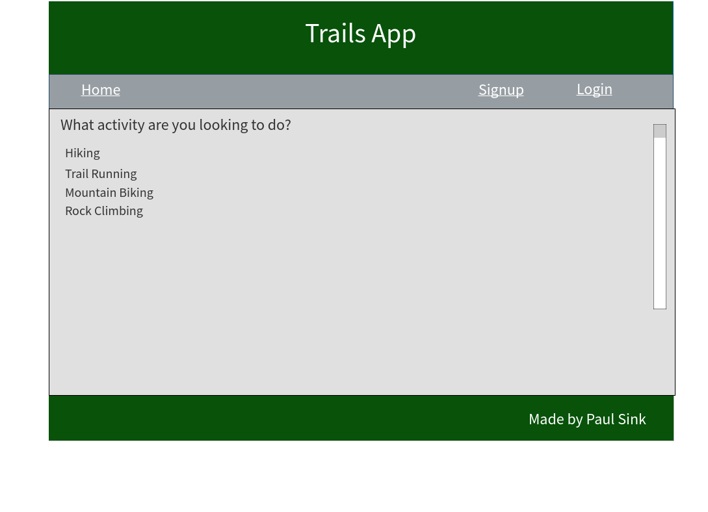
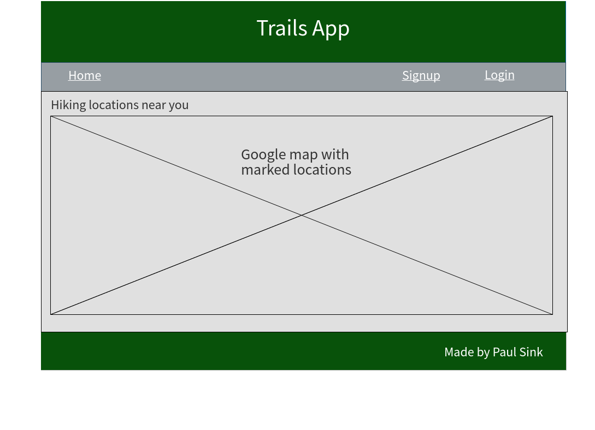
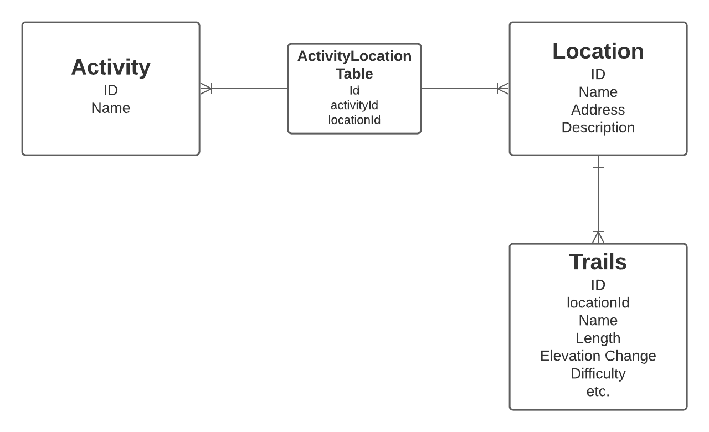
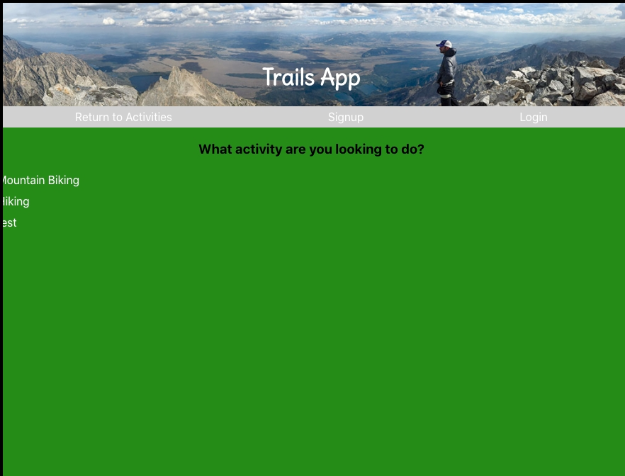
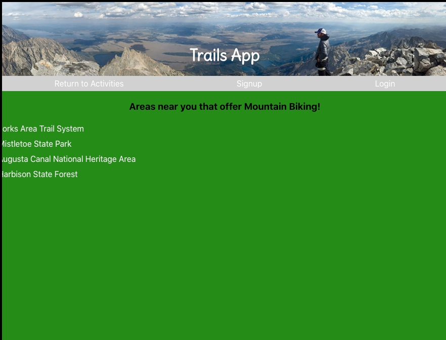

# Trails Fullstack App

## Description  

My trails app was created with the outdoor enthusiast in mind. It is used to help a user find areas and trails in their area based on what activity they area looking to do.

## Project Links

* [Github Frontend Repo](https://github.com/PaulDSink/activity-app-frontend)
* [Github Backendend Repo](https://github.com/PaulDSink/activity-app-api)
* [Frontend Deployment](https://trails-app-frontend.herokuapp.com/)
* [Backend Deployment](https://trails-app-api.herokuapp.com/)

## Approach  

My approach for this project was to determine what was needed for my minimum viable product(MVP) and create an application that met my MVP requirements. I started planning by first focusing on my MVP outcome and what it would look like to help plan using model diagrams and mapping my database structure, creating wireframes, etc.. Once I created my application to meet my MVP goals, I could then focus on adding post MVP elements.

### MVP

My MVP goals were simple. I wanted to create a functioning backend API that send locations with a list of trails for each location based on what activity the user is looking to do. I also wanted to create a user login functionality that helped determine whether that user could create, delete, or update information in  the database if they had administrator status. Then, I wanted to create a frontend application that could render and perform this functionality.

### Post MVP  

I have a lot of post MVP goals. First, I want to focus heavy on coming up with a very professional looking styling concept and user experience. I am looking to also incorporate the google maps API along with the addresses of the locations stored in my database to render a map on the locations page to help the user find locations close to them rather than viewing a long list of locations.

### Unsolved Problems  

There are many problems and loose ends I plan to correct. First, I want to create a much fuller database with many activities, locations, and trails.

### Wireframe  

### Models Diagram

## Example  

Above is an example of the functionality of my application.

## Technologies Used  

We used the following technologies on this project:
* React
* Node.js
* Express Framework
* PostgreSQL
* Postman
* JavaScript
* Axios
* CSS 3

## Contribution  

Frontend Source code: [click here](https://github.com/PaulDSink/activity-app-frontend)  
Backend Source code: [click here](https://github.com/PaulDSink/activity-app-api)  
Frontend Issue reporting: [click here](https://github.com/PaulDSink/activity-app-frontend/issues)  
Backend Issue reporting: [click here](https://github.com/PaulDSink/activity-app-api/issues)  